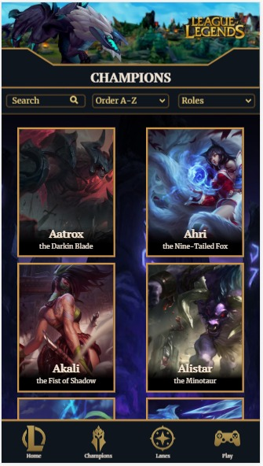
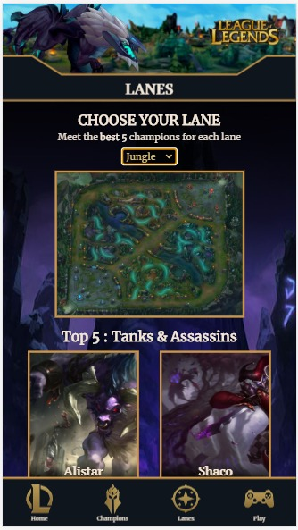
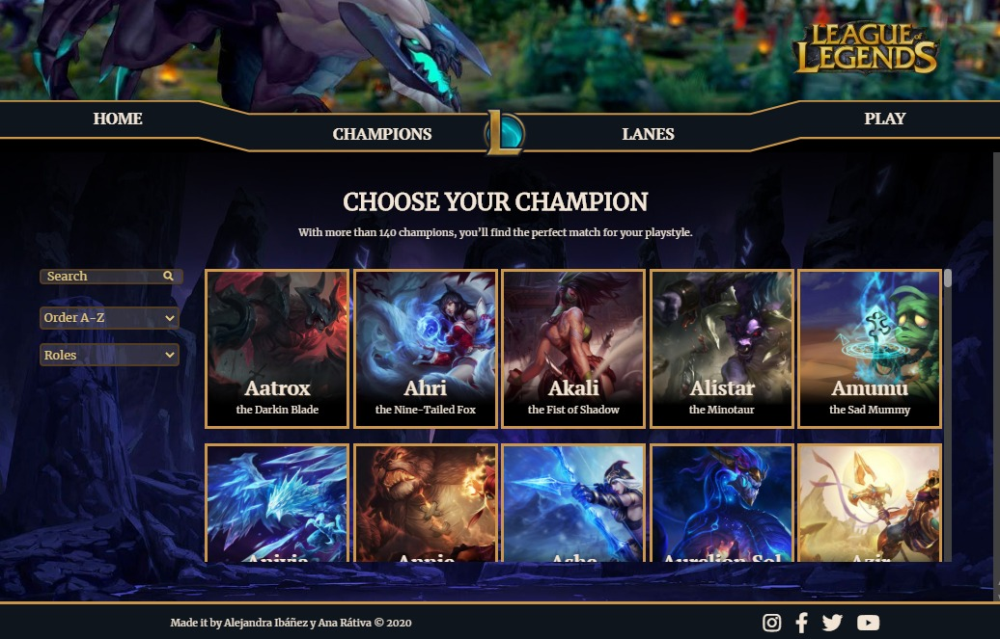
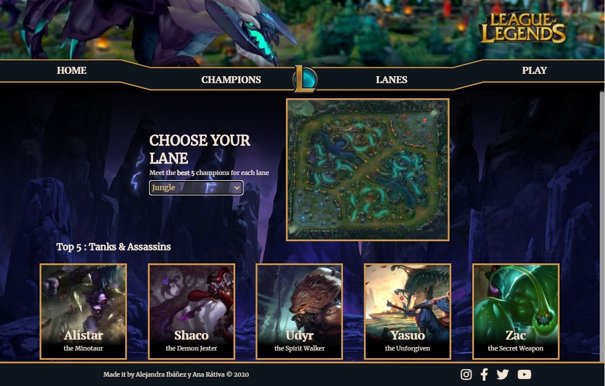
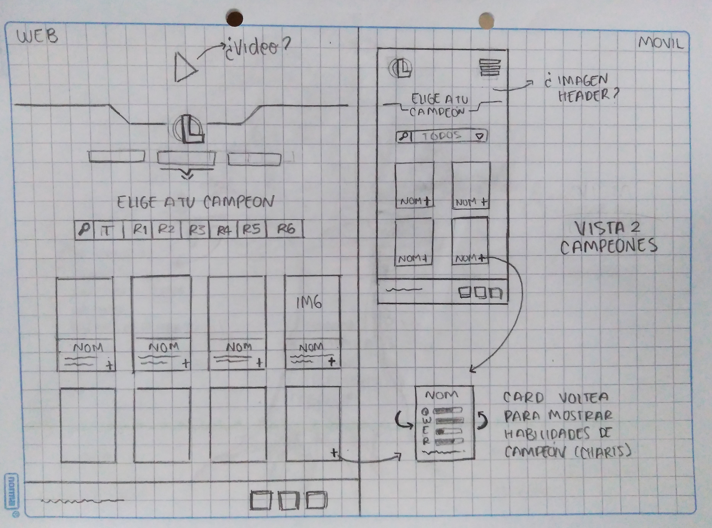
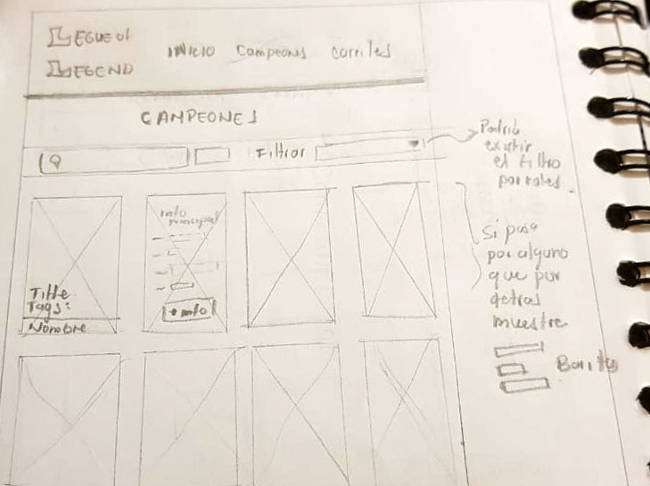
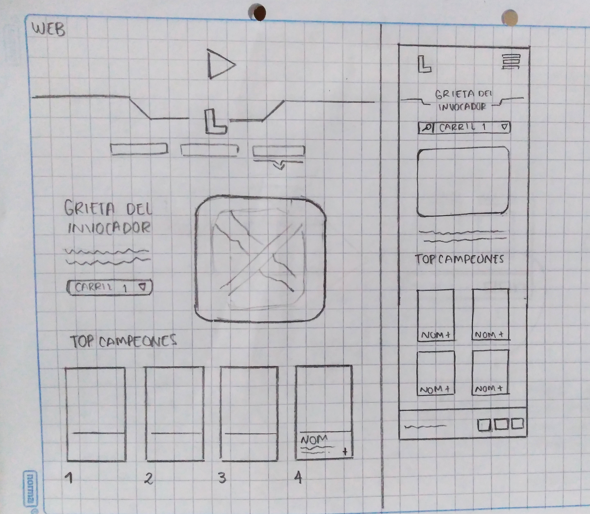
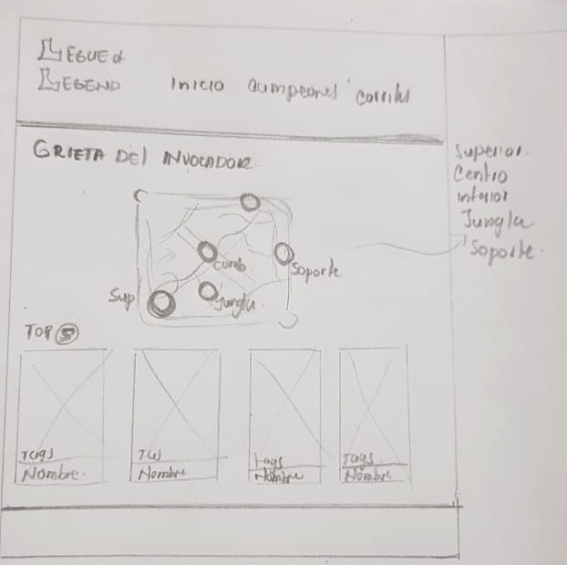
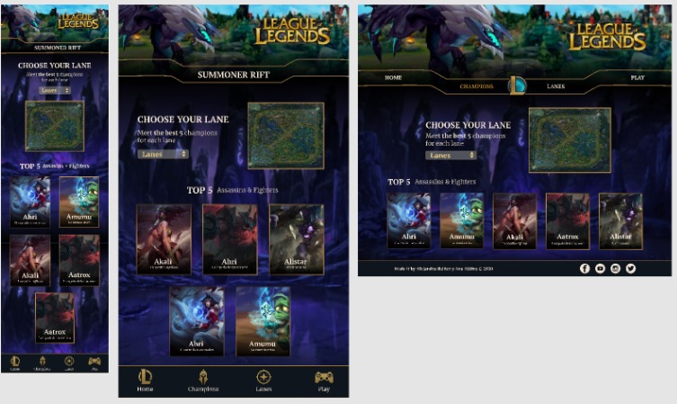
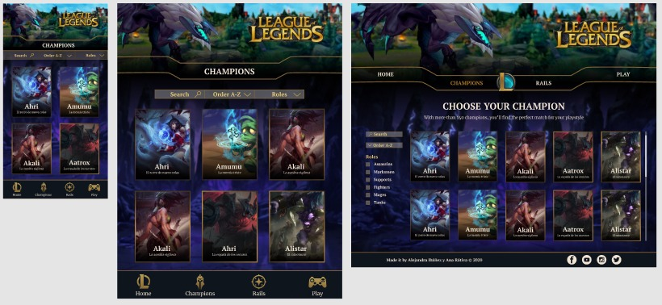

# Data Lovers LoL

## Índice
* [1. Descripción del proyecto](#1-descripción-del-proyecto)
* [2. Historias de Usuario](#2-historias-de-usuario)
* [3. Prototipos de baja fidelidad](#3-prototipos-de-baja-fidelidad)
* [4. Prototipos de alta fidelidad](#4-prototipos-de-alta-fidelidad)
* [5. Test de Usabilidad](#5-test-de-usabilidad)
* [6. Objetivos de aprendizaje](#6-objetivos-de-aprendizaje)
* [7. Checklist](#7-checklist)

***
## 1. Descripción del proyecto
**DataLovers LoL** es una interfaz que permite a los jugadores principiantes de LoL conocer los diferentes tipos de campeones con sus roles y habilidades, definiendo cuáles son los más convenientes para sus partidas. Además, los usuarios pueden descubrir los cinco mejores campeones para cada uno de los carriles de la Grieta del Invocador.

   

   

## 2. Historias de Usuario

* **HU1:** Yo como jugador de LoL, quiero ver los campeones que puedo usar para combatir.
* **HU2:** Yo como jugador de LoL, quiero saber el rol de cada campeón y poder ordenarlos (alfabéticamente) para elegir con cuál combatir.
* **HU3:** Yo como jugador de LoL, quiero buscar un campeón en específico para conocerlo.
* **HU4:** Yo como jugador de LoL, quiero saber cuáles son los 5 mejores campeones en cada carril (Grieta del invocador) para escoger con cuál jugar.

## 3. Prototipos de baja fidelidad
* Prototipos vista "Champions"

   

* Prototipos para vista "Lanes"

  

## 4. Prototipos de alta fidelidad
* Diseño en Figma: https://www.figma.com/file/MH6S9Ab3NwSiCSa0f35qXp/LoL?node-id=0%3A1
* Prototipo vista "Champions"

* Prototipo vista "Lanes"

## 5. Test de Usabilidad
Mediante los test de usabilidad logramos identificar diferentes problemas sobre los cuales se iteró hasta lograr una interfaz intuituva y agradable para el usuario.

**Problemas detectados**
* **Bajo contraste de la tipografía respecto al fondo y otros elementos:** Tenía poca legibilidad y no se lograba jerarquizar la información de manera adecuada.
* **Poca interactividad del menú versión móvil:** No se apreciaba el menú de hamburguesa y no era accesible para el usuario por su ubicación.
* **Tamaño de la barra de búsqueda versión móvil:** No permitía que el usuario interactuara fácilmente pues el espacio era muy reducido.

## 6. Objetivos de aprendizaje

### HTML y CSS

* [X] [Uso de HTML semántico.](https://developer.mozilla.org/en-US/docs/Glossary/Semantics#Semantics_in_HTML)
* [X] Uso de selectores de CSS.
* [X] Construir tu aplicación respetando el diseño realizado (maquetación).
* [X] [Uso de flexbox en CSS.](https://css-tricks.com/snippets/css/a-guide-to-flexbox/)

### DOM y Web APIs

* [X] Uso de selectores del DOM.
* [X] Manejo de eventos del DOM.
* [ ] [Manipulación dinámica del DOM.](https://developer.mozilla.org/es/docs/Referencia_DOM_de_Gecko/Introducci%C3%B3n)
(appendChild |createElement | createTextNode| innerHTML | textContent | etc.)

### JavaScript

* [X] Uso de condicionales (if-else | switch | operador ternario)
* [ ] Uso de bucles (for | for..in | for..of | while)
* [X] Uso de funciones (parámetros | argumentos | valor de retorno)
* [X] Manipular arrays (filter | map | reduce)
* [ ] Manipular arrays ( sort )
* [X] Manipular objects (key | value)
* [X] Uso ES modules ([`import`](https://developer.mozilla.org/en-US/docs/Web/JavaScript/Reference/Statements/import) | [`export`](https://developer.mozilla.org/en-US/docs/Web/JavaScript/Reference/Statements/export))
* [ ] Diferenciar entre expression y statements.
* [X] Diferenciar entre tipos de datos atómicos y estructurados.

### Testing

* [X] [Testeo unitario.](https://jestjs.io/docs/es-ES/getting-started)

### Estructura del código y guía de estilo

* [X] Organizar y dividir el código en módulos (Modularización)
* [X] Uso de identificadores descriptivos (Nomenclatura | Semántica)
* [X] Uso de linter (ESLINT)

### Git y GitHub

* [X] Uso de comandos de git (add | commit | pull | status | push)
* [X] Manejo de repositorios de GitHub (clone | fork | gh-pages)
* [X] Colaboración en Github (branches | pull requests)
* [ ] Colaboración en Github (tags)

### UX

* [X] Diseñar la aplicación pensando y entendiendo al usuario.
* [X] Crear prototipos para obtener feedback e iterar.
* [X] Aplicar los principios de diseño visual (contraste, alineación, jerarquía)
* [X] Planear y ejecutar tests de usabilidad.

## 7. Checklist

* [X] Usa VanillaJS.
* [X] No hace uso de `this`.
* [X] Pasa linter (`npm run pretest`)
* [X] Pasa tests (`npm test`)
* [X] Pruebas unitarias cubren un mínimo del 70% de statements, functions y
  lines y branches.
* [X] Incluye _Definición del producto_ clara e informativa en `README.md`.
* [X] Incluye historias de usuario en `README.md`.
* [X] Incluye _sketch_ de la solución (prototipo de baja fidelidad) en
  `README.md`.
* [X] Incluye _Diseño de la Interfaz de Usuario_ (prototipo de alta fidelidad)
  en `README.md`.
* [X] Incluye link a Zeplin o Figma en `README.md`.
* [X] Incluye el listado de problemas que detectaste a través de tests de
  usabilidad en el `README.md`.
* [X] UI: Muestra lista y/o tabla con datos y/o indicadores.
* [X] UI: Permite ordenar data por uno o más campos (asc y desc).
* [X] UI: Permite filtrar data en base a una condición.
* [X] UI: Es _responsive_.
